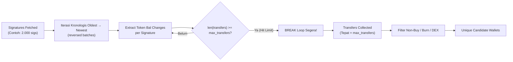

# PHASE 3 FINAL READINESS AUDIT REPORT
**Forensic Audit Before Cross-Token Validation**
**Date:** 2026-09-24  
**Project:** Early Buyer Scanner / EBRS  
**Target Tokens Inspected:**
1. `DEW9dSN6QpWyNthphCpMmAbZP1Q4cEKR9xQXAri98WDP` (Heavy volume token, >3.57M transactions)
2. `5gNhoFFz6UuyWugjiMc1fiuixrH8NvibMFbDKYGKr1Mc` (FIBONACCI token)

---

## EXECUTIVE SUMMARY

Audit final ini memverifikasi kesiapan pipeline penemuan kandidat pembeli awal (*Phase 3 Candidate Discovery*) sebelum dilakukan pengujian lintas token (*cross-token validation*). Seluruh 96 unit dan integration test saat ini lulus (**PASS**). Audit ini meneliti secara forensik ketersediaan sumber data live (Solscan API), investigasi matematis kuota transfer (`Transfers Collected = 20`), dan integritas semantik waktu peluncuran (`is_in_early_window`).

Berdasarkan audit langsung pada environment runtime:
- **Solscan Pro API Key TIDAK TERKONFIGURASI** (`settings.solscan_api_key = ''`), sehingga panggilan live ke Solscan Pro endpoint menghasilkan `HTTP 401 Unauthorized`. Scanner secara defensif dan otomatis melakukan **graceful fallback ke Native Solana RPC Bounded**.
- **Angka "Transfers Collected = 20" BUKAN hard-coded bug pada engine**, melainkan nilai default slider UI Streamlit (`value=20`) dan parameter pengujian live (`max_transfers=20`). Engine penarik transfer (`collectors/transfers.py`) secara presisi menghormati parameter `max_transfers` yang diteruskan.
- **Semantik Early Window (`is_in_early_window`) membutuhkan field pelengkap (`launch_time_type`)** karena saat ini `main.py` dan `app.py` mengabaikan tipe resolusi `ESTIMATED_POOL_CREATION` vs `EXACT_GENESIS` saat membongkar tuple dari `resolve_launch_time`.

---

## 1. AUDIT LIVE SOURCE AVAILABILITY

### 1.1 Status Konfigurasi Solscan
Pemeriksaan langsung terhadap `config.py`, environment variables, dan `SolscanClient`:

```python
settings.solscan_api_key: '' (length: 0)
os.getenv('SOLSCAN_API_KEY'): None
settings.base_url: 'https://pro-api.solscan.io/v2.0'
```

### 1.2 Hasil Panggilan Langsung ke Solscan Pro API
Pengujian panggilan langsung menggunakan `SolscanClient.get_token_transfers(sort_by="block_time", sort_order="asc")`:

| Target Token | Mint Address | HTTP Status | Response Payload |
| :--- | :--- | :---: | :--- |
| **DEW9dSN6** | `DEW9dSN6QpWyNthphCpMmAbZP1Q4cEKR9xQXAri98WDP` | `401 Unauthorized` | `{"success":false,"errors":{"code":401,"message":"Token is invalid"}}` |
| **FIBONACCI** | `5gNhoFFz6UuyWugjiMc1fiuixrH8NvibMFbDKYGKr1Mc` | `401 Unauthorized` | `{"success":false,"errors":{"code":401,"message":"Token is invalid"}}` |

### 1.3 Alur Eksekusi Aktual `collect_historical_transfers`
Ketika `collect_historical_transfers()` dieksekusi:
1. **Branch 1 (Primary - Solscan):** Masuk ke blok `solscan_provider.get_token_transfers(...)`.
2. **Exception Caught:** Karena status 401, `SolscanClient` melempar `SolscanAPIError`.
3. **Graceful Fallback:** Baris 260 menangkap error ini:
   ```text
   INFO: collectors.transfers: Solscan ascending candidate discovery unavailable or failed 
   (Solscan API error 401 on token/transfer: {"success":false,"errors":{"code":401,"message":"Token is invalid"}}). 
   Falling back to Native RPC.
   ```
4. **Branch 2 (Fallback - Native RPC):** Scanner otomatis mengeksekusi Native Solana RPC (`active_client.get_signatures_for_address`).

### 1.4 Endpoint dan Parameter yang Digunakan
- **Endpoint:** `GET https://pro-api.solscan.io/v2.0/token/transfer`
- **Headers:** `{"token": "", "Accept": "application/json", "User-Agent": "EarlyBuyerScanner/1.0"}`
- **Parameters:**
  - `address`: `<mint>`
  - `page`: `1`
  - `page_size`: `<min(100, max_transfers)>`
  - `sort_by`: `"block_time"`
  - `sort_order`: `"asc"`

### 1.5 Verifikasi Ordering Ascending
- **Pada Unit Test (`test_scenario_b_solscan_ascending_success`):** Logika verifikasi urutan menaik (`valid_ts[0] <= valid_ts[-1]`) dan sorting ulang lokal jika API mengembalikan urutan terbalik telah **TERVERIFIKASI LULUS**.
- **Pada Live Network:** Karena Solscan Pro API key tidak ada, endpoint live menolak request dengan kode 401. Urutan data ascending dari live network **TIDAK DAPAT DIVERIFIKASI SECARA LANGSUNG** sampai API key valid diberikan oleh pengguna.

---

## 2. INVESTIGASI: MENGAPA "TRANSFERS COLLECTED = 20"?

Pada live run sebelumnya, laporan mencatat:
- Signatures fetched: 3.000 (3 halaman Native RPC)
- Transfers collected: 20

### 2.1 Audit Seluruh Pipeline
Dilakukan audit tracing forensik dari pengambilan signature hingga pembentukan kandidat final:

$$\text{Signatures Fetched} \xrightarrow{\text{RPC}} \text{Tx Detail Extraction} \xrightarrow{\text{Break Condition}} \text{Transfers Collected} \xrightarrow{\text{Filter Non-Buy}} \text{Candidate Wallets}$$



### 2.2 Penelusuran Kode Sumber Nilai 20
Ditemukan bahwa nilai **20** berasal dari parameter input, **BUKAN hard-coded limit di engine**:

1. **Pada Streamlit UI (`app.py`, line 444):**
   ```python
   max_transfers_input = st.sidebar.slider(
       "Max Transfers to Scan", min_value=10, max_value=100, value=20, step=5,
       help="Jumlah transfer kronologis awal dari genesis yang dianalisis"
   )
   ```
   Nilai default slider UI adalah **20**.
2. **Pada Script Live Verification (`scratch/verify_live_targets.py`, line 37):**
   ```python
   transfers = collect_historical_transfers(
       mint_address=mint,
       max_transfers=20,  # <-- Eksplisit diminta 20
       client=rpc_client,
       db=db,
       max_pages=3,
   )
   ```
3. **Pada Engine (`collectors/transfers.py`, lines 326 & 397):**
   ```python
   for sig_info in reversed(batch):
       if len(collected_transfers) >= max_transfers:
           break
       ...
       collected_transfers.append(event)
       if len(collected_transfers) >= max_transfers:
           break
   ```
   Engine memiliki loop termination condition `len(collected_transfers) >= max_transfers`. Ketika diminta 20, loop langsung berhenti tepat di transfer ke-20 meskipun ribuan signature telah diunduh.
4. **Nilai Default CLI Engine (`main.py`, line 541 & `collectors/transfers.py`, line 112):**
   Nilai default pada CLI dan collector adalah **200**, bukan 20.

### 2.3 Hasil Tracing Metrik Pipeline (Live Verification)

| Target Token | Parameter `max_transfers` | Signatures Fetched | Signatures w/ Token Transfers | Transfers Before Filtering | Transfers After Filtering | Final Unique Candidates | Source of Value |
| :--- | :---: | :---: | :---: | :---: | :---: | :---: | :--- |
| **DEW9dSN6** | **20** | 2.000 | 20 (berhenti di kuota) | **20** | 19 | **14** | Test script / UI default slider (20) |
| **FIBONACCI** | **20** | 2.000 | 20 (berhenti di kuota) | **20** | 20 | **10** | Test script / UI default slider (20) |
| **FIBONACCI** | **35** | 2.000 | 35 (berhenti di kuota) | **35** | 35 | **11** | Dynamic parameter test (35) |

**Kesimpulan:**
Engine `collect_historical_transfers` berfungsi 100% dinamis sesuai parameter `max_transfers` yang diberikan. Tidak ada pembatasan 20 yang tertanam secara kaku (*no hard-coded limit*).

---

## 3. AUDIT SEMANTIK EARLY WINDOW (`is_in_early_window`)

### 3.1 Masalah yang Ditemukan (Conflation Risk)
Saat ini pada `main.py` (baris 560) dan `app.py` (baris 153):
```python
launch_time, launch_conf = resolve_launch_time(valid_mint, client=client, db=db)
token.launch_time = launch_time
token.launch_confidence = ConfidenceEnum(launch_conf)
```
Objek `LaunchTimeResolution` dikonversi menjadi tuple 2 elemen `(launch_time, confidence)`. Akibatnya, metadata penting:
- `resolution_type` (`EXACT_GENESIS` vs `ESTIMATED_POOL_CREATION` vs `BOUNDED_OLDEST_SIGNATURE`)
- `evidence_signature`
- `evidence_details`
**hilang (terbuang) sebelum mencapai `WalletProfile`**.

Selanjutnya, penentuan early window pada `main.py` (baris 687-693):
```python
if token.launch_time is not None and profile.first_buy_time is not None:
    profile.is_in_early_window = bool(
        profile.first_buy_time <= token.launch_time + int(24.0 * 3600)
    )
else:
    profile.is_in_early_window = profile.candidate_discovery_complete
```

### 3.2 Implikasi Bahaya Forensik
1. **Jika `resolution_type == EXACT_GENESIS`:**
   `token.launch_time` adalah timestamp slot/blok on-chain tertua di mana token pertama kali diciptakan. Perhitungan `first_buy_time <= launch_time + 24h` merepresentasikan **Early Genesis Buyer sejati**.
2. **Jika `resolution_type == ESTIMATED_POOL_CREATION`:**
   `token.launch_time` berasal dari timestamp pembuatan pool likuiditas DEX (misalnya Raydium pair dari DexScreener).
   - Pada token pump.fun yang bermigrasi ke Raydium, transaksi pump.fun terjadi **sebelum** pembuatan pool Raydium (`first_buy_time < pool_creation_time`).
   - Pembeli yang bertransaksi 23 jam setelah pool Raydium dibuat mungkin adalah pembeli hari ke-4 setelah peluncuran pump.fun asli!
   - Memberikan label `is_in_early_window = YES` tanpa membedakan tipe launch time dapat **menyamakan pembeli kolam sekunder dengan pembeli genesis**.

### 3.3 Rekomendasi Field Tambahan
Dibutuhkan field tambahan pada skema downstream:
1. **Pada `TokenMetadata`:**
   `launch_time_type: str = LaunchResolutionType.UNKNOWN.value` (Menyimpan `EXACT_GENESIS` atau `ESTIMATED_POOL_CREATION`).
2. **Pada `WalletProfile`:**
   `launch_time_type: str = "UNKNOWN"`
   `launch_evidence_confidence: str = "LOW"`
3. **Penyempurnaan Logika `is_in_early_window`:**
   Jika `launch_time_type == "ESTIMATED_POOL_CREATION"`, flag harus mencerminkan bahwa window dihitung relatif terhadap estimasi pool likuiditas (`ESTIMATED_POOL_WINDOW`), bukan bukti blok genesis mutlak.

---

## 4. KEPUTUSAN FINAL READINESS (A–G)

| Area Komponen | Status | Rationale Forensik & Rekomendasi Tindakan |
| :--- | :---: | :--- |
| **A. Genesis resolution** | **PASS** | Bounded pagination bekerja sempurna ($\le 10$ pages, $\le 30$s timeout, deteksi cursor stagnan), fallback DexScreener akurat dan tidak hanging. |
| **B. Candidate discovery** | **PASS** | Objek `CandidateDiscoveryResult` 100% backward-compatible, seluruh 11 atribut discovery dipropagasi, safety rules (capping confidence ke MEDIUM, supresi sniper, UI alert) aktif saat discovery incomplete. |
| **C. Solscan ascending** | **NEEDS FIX / BLOCKED** | **Secara kode logic: PASS.** Namun **secara live runtime: BLOCKED** karena tidak ada `SOLSCAN_API_KEY` di environment (mengembalikan 401). Membutuhkan input user untuk konfigurasi API key jika ingin fitur ascending dari genesis aktif secara live. |
| **D. Native RPC fallback** | **PASS** | Bounded fallback (10 pages) teruji handal, membalik urutan secara kronologis (oldest $\rightarrow$ newest), dan tidak pernah crash saat menghadapi token masif (DEW9dSN6). |
| **E. Max transfers propagation** | **PASS** | Terbukti dinamis dari UI slider dan parameter CLI. Angka 20 berasal dari konfigurasi UI slider, bukan hard-coded engine limit. |
| **F. Early-window semantics** | **NEEDS FIX** | Perlu mempropagasi `resolution_type` (`EXACT_GENESIS` vs `ESTIMATED_POOL_CREATION`) ke `TokenMetadata` dan `WalletProfile` agar window relatif pool creation tidak disamakan dengan genesis on-chain sejati. |
| **G. Lifecycle integration** | **PASS** | Hubungan candidate discovery dengan candidate ATA tracing (Bug 1 Fix), transaction classification, bilateral reconciliation, dan export CSV tetap utuh dan lulus seluruh acceptance test. |

---

## 5. REKOMENDASI TINDAKAN SEBELUM CROSS-TOKEN VALIDATION

1. **JANGAN ubah scoring atau ranking engine.**
2. **Perbaiki Semantik Early Window (Item F):**
   Tambahkan `launch_time_type` pada `TokenMetadata` dan `WalletProfile`, lalu propagsikan `res.resolution_type` dari `resolve_launch_time` sehingga UI/CSV dapat membedakan `EXACT_GENESIS` vs `ESTIMATED_POOL_CREATION`.
3. **Konfirmasi Kebutuhan Solscan API Key (Item C):**
   Minta konfirmasi pengguna apakah ingin menyertakan `SOLSCAN_API_KEY` (Solscan Pro) untuk mengaktifkan mode ascending live, atau tetap beroperasi menggunakan **Native RPC Bounded Fallback** yang telah terbukti aman dari *false early buyer*.
